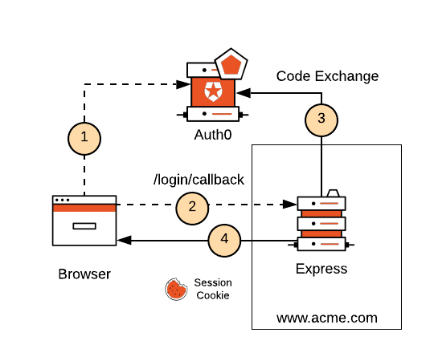

# Nuxt 3 Minimal Starter with Auth0 Authentication integrated + PrimeVue


#### Authenticated server-side rendering with Nuxt 3 and Auth0 API server middleware
<p align="center">
  
</p>

## Features
- [💚 Nuxt 3](https://nuxt.com) - SSR, ESR, File-based routing, components auto importing, modules, etc. Are you new in Nuxt3? We recommend to look at the [documentation](https://nuxt.com/docs).

- 🔥 The `<script setup>` syntax

- 🚠 Auth0 SDK Authentication services. Auth0 Federated Identity Management.

- Hapi iron module for encapsulated tokens on Cookies 

- 🚀 The PrimeVue for styled components

- 📥 APIs auto importing - for Composition API, VueUse and custom composables.

- 🦾 Mainly TypeScript

## IDE

We recommend using [VS Code](https://code.visualstudio.com/) with [Volar](https://github.com/johnsoncodehk/volar) to get the best experience (You might want to disable Vetur if you have it).

## Auth0 setup
First of all, you need to create Auth0 acount and SDK setup. 
https://auth0.com/docs/quickstart/spa/vanillajs

You need to create `.env` file with this content from Auth0 project (security credentials should never be shared):
```bash
cp .env.example .env
```


## Setup

Make sure to install the dependencies

```bash
yarn install
```

Rename .env.example as .env and set environment values

## Development

Start the development server on http://localhost:3000

```bash
yarn dev
```

## Production

Build the application for production:

```bash
yarn build
```

Checkout the [deployment documentation](https://nuxt.com/docs/getting-started/deployment).

## References
- We recommend to look at the [Nuxt3](https://nuxt.com).
- [Auth0 API](https://auth0.com/docs/api/authentication)
- [Primevue](https://www.primefaces.org/primevue/#/)
- [Hapi Iron](https://hapi.dev/module/iron/)